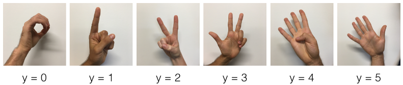
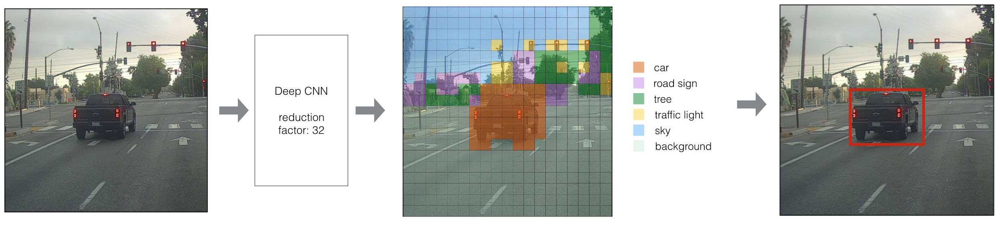
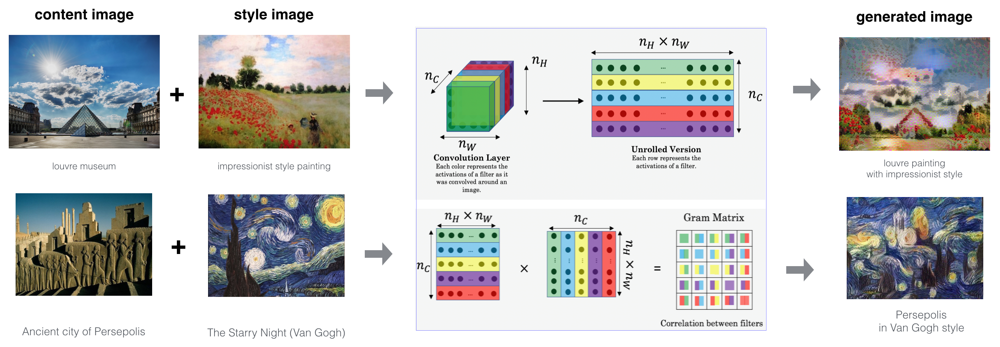

# Deep Learning Specialization on Coursera
#### [Master Deep Learning, and Break into AI](https://www.coursera.org/specializations/deep-learning)

This is my personal projects for the course. The course covers deep learning from begginer level to advanced. Highly recommend anyone wanting to break into AI. 

Instructor: [Andrew Ng, DeepLearning.ai]()

 #### Course 1. [Neural Networks and Deep Learning](https://www.youtube.com/watch?v=CS4cs9xVecg&list=PLkDaE6sCZn6Ec-XTbcX1uRg2_u4xOEky0)

1. Week1 - [Introduction to deep learning](https://github.com/enggen/Deep-Learning-Coursera/tree/master/Neural%20Networks%20and%20Deep%20Learning)
2. Week2 - [Neural Networks Basics](https://github.com/enggen/Deep-Learning-deeplearning.ai/blob/master/Neural%20Networks%20and%20Deep%20Learning/Logistic%20Regression%20with%20a%20Neural%20Network%20mindset.ipynb)
3. Week3 - [Shallow neural networks](https://github.com/enggen/Deep-Learning-deeplearning.ai/blob/master/Neural%20Networks%20and%20Deep%20Learning/Logistic%20Regression%20with%20a%20Neural%20Network%20mindset.ipynb)
4. Week4 - [Deep Neural Networks](https://github.com/enggen/Deep-Learning-deeplearning.ai/tree/master/Neural%20Networks%20and%20Deep%20Learning)

#### Course 2. [Improving Deep Neural Networks Hyperparameter tuning, Regularization and Optimization](https://www.youtube.com/watch?v=1waHlpKiNyY&list=PLkDaE6sCZn6Hn0vK8co82zjQtt3T2Nkqc)

1. Week1 - [Practical aspects of Deep Learning](https://github.com/enggen/Deep-Learning-deeplearning.ai/tree/master/Improving%20Deep%20Neural%20Networks%20Hyperparameter%20tuning%2C%20Regularization%20and%20Optimization)
         - Setting up your Machine Learning Application
         - Regularizing your neural network
         - Setting up your optimization problem
2. Week2 - [Optimization algorithms](https://github.com/enggen/Deep-Learning-deeplearning.ai/tree/master/Improving%20Deep%20Neural%20Networks%20Hyperparameter%20tuning%2C%20Regularization%20and%20Optimization)
3. Week3 - [Hyperparameter tuning, Batch Normalization and Programming Frameworks](https://github.com/enggen/Deep-Learning-Coursera/tree/master/Improving%20Deep%20Neural%20Networks%20Hyperparameter%20tuning%2C%20Regularization%20and%20Optimization)

#### Course 3. [Structuring Machine Learning Projects](https://www.youtube.com/watch?v=dFX8k1kXhOw&list=PLkDaE6sCZn6E7jZ9sN_xHwSHOdjUxUW_b)

1. Week1 - [Introduction to ML Strategy](https://github.com/enggen/Deep-Learning-Coursera/blob/master/Structuring%20Machine%20Learning%20Projects/Week%201%20Quiz%20-%20Bird%20recognition%20in%20the%20city%20of%20Peacetopia%20(case%20study).md)
         - Setting up your goal
         - Comparing to human-level performance
2. Week2 - [ML Strategy (2)](https://github.com/enggen/Deep-Learning-Coursera/blob/master/Structuring%20Machine%20Learning%20Projects/Week%202%20Quiz%20-%20Autonomous%20driving%20(case%20study).md)
         - Error Analysis
             - Mismatched training and dev/test set
             - Learning from multiple tasks
             - End-to-end deep learning
 #### Course 4. [Convolutional Neural Networks](https://www.youtube.com/watch?v=ArPaAX_PhIs&list=PLkDaE6sCZn6Gl29AoE31iwdVwSG-KnDzF)

 1. Week1 - [Foundations of Convolutional Neural Networks](https://github.com/enggen/Deep-Learning-Coursera/tree/master/Convolutional%20Neural%20Networks/Week1)
 2. Week2 - [Deep convolutional models: case studies](https://github.com/enggen/Deep-Learning-Coursera/tree/master/Convolutional%20Neural%20Networks/Week1) - Papers for read:  [ImageNet Classification with Deep Convolutional
Neural Networks](https://papers.nips.cc/paper/4824-imagenet-classification-with-deep-convolutional-neural-networks.pdf), [Very Deep Convolutional Networks For Large-Scale Image Recognition](https://arxiv.org/pdf/1409.1556.pdf)
 3. [Week3 - Object detection](https://github.com/enggen/Deep-Learning-Coursera/tree/master/Convolutional%20Neural%20Networks/Week3/Car%20detection%20for%20Autonomous%20Driving) - Papers for read: [You Only Look Once:
Unified, Real-Time Object Detection](https://arxiv.org/pdf/1506.02640.pdf), [YOLO](https://arxiv.org/pdf/1612.08242.pdf)
 4. Week4 - [Special applications: Face recognition & Neural style transfer](https://github.com/enggen/Deep-Learning-Coursera/tree/master/Convolutional%20Neural%20Networks/Week4) - Papers for read: [DeepFace](https://www.cs.toronto.edu/~ranzato/publications/taigman_cvpr14.pdf), [FaceNet](https://www.cv-foundation.org/openaccess/content_cvpr_2015/papers/Schroff_FaceNet_A_Unified_2015_CVPR_paper.pdf)

 #### Course 5. [Sequence Models](https://www.youtube.com/watch?v=DejHQYAGb7Q&list=PLkDaE6sCZn6F6wUI9tvS_Gw1vaFAx6rd6)
 1. Week1 - [Recurrent Neural Networks](https://github.com/enggen/Deep-Learning-Coursera/tree/master/Sequence%20Models/Week1)
 2. Week2 - [Natural Language Processing & Word Embeddings](https://github.com/enggen/Deep-Learning-Coursera/tree/master/Sequence%20Models/Week2)
 3. Week3 - [Sequence models & Attention mechanism](https://github.com/enggen/Deep-Learning-Coursera/tree/master/Sequence%20Models/Week3)

 #### --Completed--

Logistic Regression with Neural Network, [here](https://github.com/DarwinSaire/Projects-Deep-Learning-Specialization/blob/master/Neural%20Networks%20and%20Deep%20Learning/Logistic%20Regression%20with%20a%20Neural%20Network%20mindset.ipynb)

Deep Neural Network for Image Classification, [here](https://github.com/DarwinSaire/Projects-Deep-Learning-Specialization/blob/master/Neural%20Networks%20and%20Deep%20Learning/Deep%20Neural%20Network%20-%20Application.ipynb)

SIGN language classification with RestNet50, [here](https://github.com/enggen/Deep-Learning-Coursera/blob/master/Convolutional%20Neural%20Networks/Week2/ResNets/Residual%20Networks%20-%20v1.ipynb)

Autonomous driving - Car detection with YOLO, [here](https://github.com/enggen/Deep-Learning-Coursera/blob/master/Convolutional%20Neural%20Networks/Week3/Car%20detection%20for%20Autonomous%20Driving/Autonomous%20driving%20application%20-%20Car%20detection%20-%20v1.ipynb)

Face Recognition for the Happy House with FaceNet and DeepFace (triplet loss), [here](https://github.com/enggen/Deep-Learning-Coursera/blob/master/Convolutional%20Neural%20Networks/Week4/Face%20Recognition/Face%20Recognition%20for%20the%20Happy%20House%20-%20v2.ipynb)

Neural Style Transfer [here](https://github.com/enggen/Deep-Learning-Coursera/blob/master/Convolutional%20Neural%20Networks/Week4/Neural%20Style%20Transfer/Art%20Generation%20with%20Neural%20Style%20Transfer%20-%20v1.ipynb)

